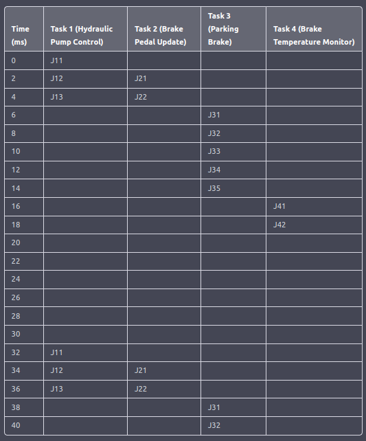

# Past Paper 2017

## Question 1

### Q1 Part A

The Task Control Block (TCB) is a data structure used by the µCOS-II kernel to manage and control the execution of tasks. Each task in the system has its own TCB, which contains information about the task such as its state, priority, stack pointer, and other data needed by the kernel to manage the task.

During task scheduling, the kernel uses the information in the TCBs to determine which task should be executed next. The kernel maintains a list of all of the tasks and their corresponding TCBs, and uses this information to determine which task should be given control of the processor.

During a context switch, the kernel saves the context (such as the values of registers and the program counter) of the task that is currently executing, and restores the context of the task that is being scheduled to run. The kernel uses the information in the TCB, such as the stack pointer, to determine where to save and restore the task's context.

Overall, the TCB plays a crucial role in the task scheduling and context switching functions of the μCOS-II kernel by providing the necessary information to manage the tasks and switch between them.

### Q1 Part B

A mutex and a binary semaphore are both synchronization mechanisms that are used to control access to shared resources in µCOS-II. They both serve the same basic purpose, but they have some important differences in their implementation and usage.

A mutex is a synchronization mechanism that is used to ensure that only one task has access to a shared resource at any given time. When a task wants to access the resource, it must first obtain the mutex by calling a kernel function. If the mutex is available, the kernel grants the mutex to the task and allows it to access the resource. If the mutex is not available, the kernel blocks the task until the mutex becomes available. When the task is finished using the resource, it releases the mutex so that other tasks can access the resource.

A binary semaphore is also a synchronization mechanism that is used to control access to a shared resource. However, unlike a mutex, a binary semaphore can be used to synchronize access to the resource by multiple tasks. When a task wants to access the resource, it must first obtain the semaphore by calling a kernel function. If the semaphore is available, the kernel grants the semaphore to the task and allows it to access the resource. If the semaphore is not available, the kernel blocks the task until the semaphore becomes available. When the task is finished using the resource, it releases the semaphore so that other tasks can access the resource.

In summary, the main difference between a mutex and a binary semaphore is that a mutex can only be used to synchronize access to a resource by one task, while a binary semaphore can be used to synchronize access to a resource by multiple tasks. Therefore, the choice between using a mutex or a binary semaphore in a given situation depends on the specific requirements of the application and the nature of the shared resource being accessed.

### Q1 Part C

Cooperative priority-based schedulers and preemptive priority-based schedulers are two different approaches to task scheduling in operating systems. They both aim to provide efficient and fair allocation of processor time to tasks, but they have different performance goals and trade-offs.

Cooperative priority-based schedulers are designed to ensure that each task gets a fair amount of processor time based on its priority. In a cooperative scheduler, each task is responsible for voluntarily yielding the processor when it is finished with its current work, allowing other tasks to run. This approach allows for efficient use of the processor and can provide good overall performance, but it relies on each task to cooperate and yield the processor in a timely manner.

Preemptive priority-based schedulers, on the other hand, are designed to ensure that high-priority tasks are given priority over lower-priority tasks. In a preemptive scheduler, the kernel can interrupt a running task and forcibly switch to a higher-priority task at any time. This approach provides more robust scheduling and can prevent lower-priority tasks from monopolizing the processor, but it can also result in more frequent context switches and overhead.

One reason developers might choose to use a cooperative scheduler is because it can provide better performance in some situations. Because cooperative schedulers rely on tasks to voluntarily yield the processor, they can be more efficient than preemptive schedulers, which must constantly check for higher-priority tasks and perform context switches. This can make cooperative schedulers a good choice for applications that require high performance or that have a small number of tasks that can be easily managed.

On the other hand, preemptive schedulers are often preferred in situations where the number of tasks or the nature of the tasks is unpredictable or uncontrolled. In these situations, a preemptive scheduler can provide more robust scheduling and prevent lower-priority tasks from starving higher-priority tasks. It can also be easier to use and develop for, because it does not require tasks to explicitly cooperate and yield the processor.

### Q1 Part D

Jitter is a term used to describe the variation or fluctuation in the timing of events or signals in a system. In a real-time system, jitter can be observed as variations in the time at which tasks are scheduled to run, or as variations in the time at which interrupts are serviced. Jitter can have a negative impact on the performance and reliability of a real-time system, because it can cause tasks to miss deadlines or interfere with the correct operation of the system.

Jitter can be observed and quantified in a system designed around µCOS-II by measuring the actual time at which events or signals occur, and comparing it to the expected or desired time at which they should occur. This can be done using a variety of tools and techniques, such as using a real-time clock or a high-resolution timer to measure the time at which events occur, or using software tools to analyze and visualize the timing of events in the system.

There are many possible causes of jitter in a real-time system, including hardware and software factors. Two possible causes of jitter are:

- Interrupt latencies: Interrupts are a common source of jitter in real-time systems, because they can cause delays or variations in the timing of tasks and other events. In a system designed around µCOS-II, interrupt latencies can be caused by factors such as the time it takes for the kernel to handle and service an interrupt, or the time it takes for a task to resume execution after an interrupt.

- Task scheduling: Task scheduling can also be a source of jitter in a system designed around µCOS-II, because the kernel must decide which tasks to run and when to switch between tasks. Jitter can be caused by factors such as the algorithm the kernel uses to schedule tasks, or the priority and timing of tasks in the system.

In summary, jitter is a variation in the timing of events or signals in a system, and it can have negative effects on the performance and reliability of a real-time system. Jitter can be observed and quantified in a system designed around µCOS-II, and it can be caused by factors such as interrupt latencies and task scheduling.

### Q1 Part E

The statement "multi-tasking provides better average task performance (reduced response-time) than cyclic executives" is generally true, but it is not always the case. Both multi-tasking and cyclic executives can provide efficient and effective execution of tasks, but they have different performance characteristics and trade-offs, and which approach is better depends on the specific requirements and constraints of the system.

In general, multi-tasking provides better average task performance than cyclic executives because it allows for more flexible and dynamic allocation of processor time to tasks, which can result in better utilization of the processor and faster response times for tasks. In a multi-tasking system, the kernel can schedule and switch between tasks based on factors such as the priority and workload of each task, which can improve the overall performance of the system.

However, there are situations in which an embedded system designer might prefer a cyclic executive over a multi-tasking solution. One reason for this is that cyclic executives can provide more predictable and deterministic behavior, which can be important in some applications. For example, if an application requires strict timing and synchronization between tasks, a cyclic executive can provide a more reliable and predictable execution model.

Another reason why an embedded system designer might prefer a cyclic executive is that it can be simpler and easier to use and develop for. Cyclic executives are typically based on a fixed and regular execution pattern, which can make it easier to design and implement tasks and other system components. In contrast, multi-tasking systems can be more complex and require more careful design and implementation to ensure good performance.

In summary, the statement "multi-tasking provides better average task performance (reduced response-time) than cyclic executives" is generally true, but there are situations in which an embedded system designer might prefer a cyclic executive over a multi-tasking solution. This can be because a cyclic executive provides more predictable and deterministic behavior, or because it is simpler and easier to use and develop for.

## Question 2

An embedded real-time system is a type of system that is designed to perform a specific task within a pre-defined time frame. In this case, the system consists of a PIC18 microcontroller, which is a type of microcontroller that is commonly used in embedded systems due to its small size and low power consumption. The PIC18 is connected to a 4x16 LCD display via an 8-bit interface, which allows the microcontroller to send and receive data from the display. The system also includes a digital temperature sensor that can be configured for 8 to 12 bits of resolution, meaning that it can provide a high level of accuracy in measuring temperature. Overall, this system is likely used to display temperature readings on the LCD display in real-time.

### Q2 Part A

Sensor linearization and sensor calibration are both techniques that are used to improve the accuracy and precision of a sensor. However, they are different in the way that they achieve this improvement.

Sensor linearization is the process of making a nonlinear sensor behave in a more linear manner. This is typically done by applying a correction factor to the sensor's output to account for any nonlinearity in its response to the measured quantity. In the case of a temperature sensor, linearization could be used to correct for the fact that the sensor's response to temperature changes is not always linear. Linearization could be performed in hardware by using additional circuitry to compensate for the nonlinearity, or in software by applying a correction factor to the sensor's output.

Sensor calibration, on the other hand, is the process of adjusting a sensor so that it provides accurate and precise measurements. This is typically done by comparing the sensor's output to known reference values and adjusting the sensor's settings or applying a correction factor to its output as needed. Calibration could be performed in hardware by using precision temperature references and specialized equipment, or in software by using algorithms and reference data. In the case of the temperature sensor in the system described above, calibration could be used to ensure that the sensor is providing accurate and precise temperature readings.

### Q2 Part B

To determine the maximum rate at which parallel 8-bit data can be clocked out from a microprocessor, we need to consider the rise/fall time of the microprocessor's output pin and the number of bits that are being transferred. The rise/fall time of a signal refers to the amount of time it takes for the signal to transition from its low state to its high state (rise time) or from its high state to its low state (fall time).

Assuming that the microprocessor is using a separate clock line, we can calculate the maximum data transfer rate using the following formula:

$$ \text{Data Transfer Rate}(bits/second) = \frac{1}{\text{rise/fall time in seconds} \times \text{number of bits}} $$

For example, if the rise/fall time of the microprocessor's output pin is 0.1 microseconds (tµs) and it is transferring 8-bit data, the maximum data transfer rate would be:

$$ \text{Data Transfer Rate}(bits/second) = \frac{1}{0.1\mu s \times 8} = 1.25 \times10^{7}(bits/second)$$

This means that the microprocessor can transfer data at a rate of up to 1.25 million bits per second. Of course, this is only the maximum theoretical data transfer rate and the actual transfer rate may be limited by other factors such as the speed of the clock signal and the capabilities of the receiving device.

One assumption that is made in this calculation is that the rise/fall time of the microprocessor's output pin is constant. This is not always the case in practice, as the rise/fall time can vary depending on factors such as the load on the output pin and the supply voltage. Therefore, the actual data transfer rate may be different from the value calculated above. It is also worth noting that this calculation does not account for any overhead associated with clocking out the data, such as the time needed to setup and hold the data on the output pins. These factors may further reduce the actual data transfer rate.

### Q2 Part C

The statement you have provided suggests that the resolution of a measurement can be improved by taking multiple readings and averaging them. This is true in cases where the dominant source of error in the measurement is noise, which is a random variation in the signal being measured. In such cases, averaging multiple readings can help to reduce the noise and improve the resolution of the measurement.

However, if the dominant source of error in the measurement is quantization, which is the process of representing a continuous value using a finite number of discrete steps, then averaging multiple readings will not help to improve the resolution. This is because quantization errors are not random, but are determined by the finite number of steps used to represent the continuous value. As a result, averaging multiple readings will not reduce the quantization error, and the resolution of the measurement will remain the same.

### Q2 Part D

The statement that the PIC 16F877 micro-controller is unsuited for real-time systems is not necessarily true. While it is true that the PIC 16F877 is not specifically designed for real-time systems, it can still be used in such systems under certain conditions.

One of the main factors that determines the suitability of a micro-controller for real-time systems is its processing speed and ability to perform tasks within a predetermined time frame. The PIC 16F877 has a relatively slow processing speed compared to other micro-controllers, which can make it challenging to use in real-time systems that require fast response times. However, if the real-time system has relatively simple tasks and does not require very fast processing speeds, the PIC 16F877 may be able to meet the requirements.

Another factor that determines the suitability of a micro-controller for real-time systems is its memory and storage capacity. The PIC 16F877 has a relatively small amount of memory and storage compared to other micro-controllers, which can limit its ability to handle complex real-time tasks. However, if the real-time system has relatively simple tasks and does not require a large amount of memory or storage, the PIC 16F877 may still be able to meet the requirements.

In summary, while the PIC 16F877 is not specifically designed for real-time systems, it can still be used in such systems under certain conditions. The suitability of the PIC 16F877 for a real-time system will depend on the specific requirements of the system, including the processing speed and memory requirements of the tasks it needs to perform.

### Q2 Part E

The key function calls in the C18 libraries for accessing the LCD would likely include the following:

1. lcd_init() - This function initializes the LCD and prepares it for display.

1. lcd_putc() - This function outputs a character to the LCD at the current cursor position.

1. lcd_gotoxy() - This function moves the cursor to a specified position on the LCD.

1. lcd_clear() - This function clears the LCD and resets the cursor to the top-left position.

1. lcd_puts() - This function outputs a string of characters to the LCD at the current cursor position.

For example, a C-like code that uses these functions to display a message on the LCD might look something like this:

```C
void app_main()
{
    lcd_init(); // Initialize the LCD
    lcd_clear(); // Clear the LCD
    lcd_gotoxy(1, 1); // Move the cursor to the top-left position
    lcd_puts("Hello, world!"); // Output the message to the LCD
}
```

In this code, the "lcd_init()" and "lcd_clear()" functions are called first to initialize the LCD and clear its display.

The "lcd_gotoxy()" function is then used to move the cursor to the top-left position. Finally, the "lcd_puts()" function is used to output the message to the LCD.

## Question 3

Task 1 - Hydraulic Pump Control is responsible for maintaining the pressure in the hydraulic system at a desired level by adjusting the hydraulic pump command. This task reads the pressure sensor value at J11, calculates the new pressure command at J12, and outputs the new command at J13. It runs at a 10ms interval.

Task 2 - Brake Pedal Update reads the status of the left and right brake pedals and controls the left and right hydraulic valves accordingly. It runs at a 10ms interval with a phase delay of 5ms. At J21, it reads the left brake pedal and outputs the value to the left valve. At J22, it reads the right brake pedal and outputs the value to the right valve.

Task 3 - Parking Brake is responsible for engaging and disengaging the parking brake. It runs at a 50ms interval. At J31, it reads the left and right brake pedals. If both pedals are fully depressed at J32, it locks the parking handle. If both pedals are not depressed at J33, it releases the parking handle. If the parking handle is up and locked at J34, it turns the parking valve on. If the parking handle is released at J35, it turns the parking valve off.

Task 4 - Brake Temperature Monitor reads the temperature sensors, stores the maximum temperature value, and controls the BRAKE TEMP light. It runs at a 50ms interval. At J41, it reads the temperature sensors and stores the maximum value. At J42, it turns on the BRAKE TEMP light if the temperature is greater than 5, and turns it off otherwise.

### Q3 Part A

Here is a cyclic schedule for the execution of the jobs in the embedded system scenario, with a minor cycle of 10ms:

Minor Cycle 1:

J11 (Hydraulic Pump Control - Pressure Sensor)
J21 (Brake Pedal Update - Left Brake Pedal)
J22 (Brake Pedal Update - Right Brake Pedal)
Minor Cycle 2:

J12 (Hydraulic Pump Control - Calculate new Pressure Command)
Minor Cycle 3:

J13 (Hydraulic Pump Control - Output new Pressure Command)
Minor Cycle 4:

J31 (Parking Brake - Read Left Brake Pedal and Right Brake Pedal)
Minor Cycle 5:

J32 (Parking Brake - Lock Parking Handle)
Minor Cycle 6:

J33 (Parking Brake - Release Parking Handle)
Minor Cycle 7:

J34 (Parking Brake - Turn Parking Valve On)
Minor Cycle 8:

J35 (Parking Brake - Turn Parking Valve Off)
Minor Cycle 9:

J41 (Brake Temperature Monitor - Read Temperature Sensors)
Minor Cycle 10:

J42 (Brake Temperature Monitor - Control BRAKE TEMP Light)
This schedule can be represented graphically as follows:

Minor Cycle 1:

J11 J21 J22

Minor Cycle 2:

J12

Minor Cycle 3:

J13

Minor Cycle 4:

J31

Minor Cycle 5:

J32

Minor Cycle 6:

J33

Minor Cycle 7:

J34

Minor Cycle 8:

J35

Minor Cycle 9:

J41

Minor Cycle 10:

J42

This schedule ensures that all tasks are completed within the required response time and that the minor cycle of 10ms is maintained. The tasks are executed in a cyclic manner, with each task being executed in a specific minor cycle.

### Q3 Part B

Here is a task timeline for the execution of the jobs in the embedded system scenario, assuming that they are scheduled using a pre-emptive priority-based scheduler, with a 2ms tick:



This task timeline demonstrates how the tasks are executed using a pre-emptive priority-based scheduler. Task 1 has the highest priority, followed by Task 2, then Task 3, and then Task 4 has the lowest priority. The tasks are executed in a cyclic manner, with each task being executed in a specific time slot within the minor cycle. Task 1 is executed at every 2ms tick, while Task 2 is executed every 4ms tick. Task 3 is executed every 8ms tick, and Task 4 is executed every 16ms tick. The tasks are pre-empted if a higher priority task becomes available, as can be seen in the timeline. For example, at time 18, Task 4 is pre-empted by Task 1, which has a higher priority.

### Q3 Part C

There are several criteria that can be used to compare the performance of the cyclic executive and the pre-emptive priority-based scheduler in the embedded system scenario:

Response time: The response time refers to the time it takes for a task to complete its execution. In the cyclic executive, all tasks are executed in a fixed order, at specific time intervals within the minor cycle. This means that the response time for each task is known and deterministic. In the pre-emptive priority-based scheduler, the response time for a task can vary depending on the priority of the task and the availability of other tasks with higher priority.

Utilization: Utilization refers to the percentage of time that the system is busy executing tasks. In the cyclic executive, all tasks are executed in a fixed order, at specific time intervals within the minor cycle. This means that the utilization of the system is known and deterministic. In the pre-emptive priority-based scheduler, the utilization of the system can vary depending on the priority of the tasks and the availability of other tasks with higher priority.

Based on these criteria, it may be preferable to implement the cyclic executive, as it offers deterministic response times and utilization. However, if the system requires high responsiveness and the ability to handle tasks with varying priority levels, the pre-emptive priority-based scheduler may be a better choice. In this case, adjustments may need to be made to the priority levels of the tasks to ensure that the system performs optimally.

### Q3 Part D

Rate Monotonic Scheduling (RMS) is a fixed priority scheduling algorithm that assigns priorities to tasks based on their periodic execution rates. The task with the highest rate is assigned the highest priority, and tasks with lower rates are assigned lower priorities. In RMS, the priority of a task does not change during its execution.

Least Slack Time Scheduling (LSTS) is a dynamic priority scheduling algorithm that assigns priorities to tasks based on their remaining execution time. The task with the least remaining execution time is assigned the highest priority, and tasks with more remaining execution time are assigned lower priorities. In LSTS, the priority of a task can change during its execution.

Based on the embedded system scenario, the relative priorities of the 4 tasks can be determined as follows:

Rate Monotonic Scheduling:

- Task 1 (Hydraulic Pump Control) - Priority 3
- Task 2 (Brake Pedal Update) - Priority 2
- Task 3 (Parking Brake) - Priority 1
- Task 4 (Brake Temperature Monitor) - Priority 4

Least Slack Time Scheduling:

- Task 1 (Hydraulic Pump Control) - Priority varies depending on remaining execution time
- Task 2 (Brake Pedal Update) - Priority varies depending on remaining execution time
- Task 3 (Parking Brake) - Priority varies depending on remaining execution time
- Task 4 (Brake Temperature Monitor) - Priority varies depending on remaining execution time

In RMS, the priorities of the tasks are fixed and do not change during their execution. In LSTS, the priorities of the tasks can change based on their remaining execution time. RMS is suitable for systems with tasks that have fixed and known execution rates, while LSTS is suitable for systems with tasks that have varying execution times and deadlines.

### Q3 Part E

It is feasible to implement the system described using a foreground-background approach, where certain tasks are executed in the background while others are executed in the foreground.

In this implementation, Tasks 3 and 4 would run in the background, while Task 1 would be called in the interrupt handler for the timer and Task 2 would be called in the interrupt handler for the interrupt-on-change signal from the brake pedals.

One potential benefit of this implementation is that it allows the system to respond quickly to changes in the brake pedal position and to perform the tasks related to the hydraulic pump and brake temperature monitoring in the background, without interrupting the foreground tasks. This can help to ensure that the system remains responsive and that the brake pedals are able to function correctly.

However, it is important to carefully consider the real-time requirements of the system and ensure that the foreground and background tasks are able to complete their respective tasks within the required time constraints. If the system is not able to meet these real-time requirements, it may result in unsafe or unreliable behavior.

To detect and address any potential issues with this implementation, it may be necessary to use various resources and procedures, such as performance monitoring tools, debuggers, and code analysis tools, to identify and resolve any problems that may arise. Additionally, it may be necessary to carefully test the system to ensure that it is able to meet the required real-time constraints and that it functions correctly under a variety of different conditions.
