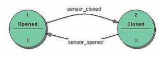
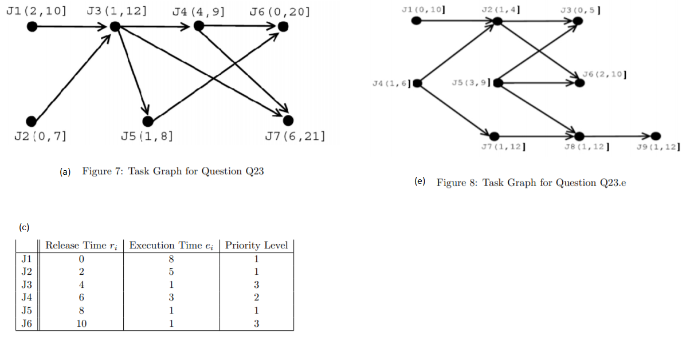

# Problem Set Questions

## Section A

### Question 1

Using a search engine (such as Google), find and download a data sheet for an example of the specified type of peripheral chip. Read through the sheet, highlighting all references to internal registers. Ensure you have their access address and functions clearly distinguished. Plan a C language initialization routine to interface the peripheral to the ESP-01:

- (i) SPI sensor

- (ii) Dallas 1-wire sensor

### Question 2

Review the following case studies and identify the characteristics of an appropriate processor.

- Case Study A: Leak Detection

- Case Study B: Driver Assistance

- Case Study C: Conveyor System

You should use Table 1 from Koopman as a template.

| An example of                            | Signal Processing                 | Mission Critical                              | Distributed                                                 | Small                                                       |
|------------------------------------------|-----------------------------------|-----------------------------------------------|-------------------------------------------------------------|-------------------------------------------------------------|
| Computing Speed                          | 1 GFLOPS                          | 10 - 100 MIPS                                 | 1 - 10 MIPS                                                 | 100,000 IPS                                                 |
| I/O Transfer Rates                       | 1 Gb/sec                          | 10 Mb/sec                                     | 100 kb/sec                                                  | 1 kb/sec                                                    |
| Memory Size                              | 32 -128 MB                        | 16 - 32 Mb                                    | 1 -16 Mb                                                    | 1 kb                                                        |
| Units Sold                               | 10 - 500                          | 100 - 1000                                    | 100 - 10,000                                                | 100,000+                                                    |
| Development Cost                         | $20M - $100M                      | $10M - $50M                                   | $1M - $10M                                                  | $100K - $1M                                                 |
| Lifetime                                 | 15 -30 Years                      | 20 -30 Years                                  | 25 - 50 Years                                               | 10 - 15 Years                                               |
| Environment                              | Vibration, Heat                   | Heat, Vibration, Lightning                    | Dirt, Fire                                                  | Over-Voltage, Heat, Vibration                              |
| Cost Sensitivity                         | $1000                             | $100                                          | $10                                                         | $0.05                                                       |
| Other Constraints                        | Size, Weight, Power               | Size, Weight                                  | Size                                                        | Size, Weight, Power                                         |
| Safety                                   | -                                 | Redundancy                                     | Mechanical Safety                                           | -                                                           |
| Maintenance                              | Frequent Repairs                  | Aggressive Fault detection/maintenance        | Scheduled maintenance                                    | "Never" breaks                                              |
| Digital Content                          | Digital except for signal I/O     | ~1/2 Digital                                  | ~1/2 Digital                                                | Single digital chip; rest is analog/power                  |
| Certification Authorities                 | Customer                          | Federal Government                            | Development Team                                            | Customer; Federal Government                                |
| Repair Time Goal                         | 1 - 12 hours                      | 30 minutes                                    | 4 min - 12 hours                                            | 1 - 4 hours                                                 |
| Initial Cycle Time                       | 3 - 5 years                       | 4 - 10 years                                  | 2 - 4 years                                                 | 0.1 - 4 years                                               |
| Product Variants                         | 1 - 5                             | 5 - 20                                        | 10 - 10,000                                                 | 3 - 10                                                      |
| Engineering Allocation Method            | Per-product budget                | Per-product budget                            | Allocation from large pool                                  | Demand-driven daily from small pool                         |
| Other possible examples in this category | Radar/Sonar Video Medical Imaging | Jet engines; Manned spacecraft; Nuclear Power | High-rise elevators; Trains/trams/subways; Air conditioning | Automotive auxiliaries; Consumer electronics; "Smart" I/O |

### Question 3

Write down the C declaration of a variable ’p’ such that ’p’ is:

- (a) A pointer to a pointer to an integer

- (b) An array of ten pointers to integers

- (c) A pointer to an array of ten integers

- (d) A pointer to a function that takes an integer as an argument and returns an integer

- (e) An array of ten pointers to functions that take an integer argument and return an integer

### Question 4

Identify the equations which describe the impact of the following effects in the analog front-end circuitry on the effective number of bits that can be detected at the microprocessor:

- (a) Attenuators

- (b) Amplifiers

- (c) Analog multiplexer settling time

- (d) Anti-aliasing analog low pass filter roll-off

- (e) Sample and hold – sampling time

### Question 5

(a) An embedded system uses a 12-bit ADC to sample the fluid flow through an oil pipe.The flow can vary from -20 to +20 L/min. The appropriate transducer and analog circuit maps in a linear fashion the full scale flow rate into the 0 to +5V full scale range of the ADC. I.e., -20 L/min maps to 0V and +20 L/min maps to +5V. The ADC uses straight binary: 0V maps to 0 and +5V maps to the largest digital output. Oil flow readings are stored using fixed point representation.

- i. What ADC value do you get if the flow rate is -10 L/min.

- ii. What resolution will you use for fixed-point number system to store the oil flow data?

(b) A measurement system has a range of 0 to 19.9 cm and a resolution of 0.1 cm. A variable must be allocated in RAM to store the readings from this measurement system. Identify the representation scheme that can store the reading in the smallest number of bytes. Explain your answer, using the readings 4.1cm and 19.7cm.

(c) A system uses an 8-bit DAC and a serial port running at 10000 bits/sec. 8-bit serial data is received in 11-bit packets consisting of a start bit, 8 data bits, a parity bit, and a stop bit. Every 8-bit data value received over serial port is output to the DAC.

- i. How many data bytes of information are being transferred each second?

- ii. At this rate, what would the be DAC output rate in Hz?

- iii. What is the maximal frequency that the DAC can reliably generate? Explain your answer.

(d) “If the noise effect rather than quantization predominates, the resolution can be increased by averaging several readings.” Explain this statement. Why does averaging not “work” if quantization rather than noise predominates?

(e) “Interrupt overload is not necessarily caused by high interrupt loads but rather by unexpectedly high interrupt loads.” Explain this statement. What measures can be taken to reduce impact of interrupt overload ?

### Question 6

(a) Determine the maximum rate at which serial 8-bit data can be clocked out from a microprocessor whose output pin rise/fall time is tμs. You should presume that the transmission is asynchronous.

(b) Determine the maximum rate at which parallel 8-bit data can be clocked out from a microprocessor whose output pin rise/fall time is tμs. You should presume a separate clock line is in use.

(c) Differentiate between sensor linearization and sensor calibration. Explain how each can be accomplished in either hardware or software.

(d) Direct interfacing allows impedance based sensor values to be determined by timing a discharge, without intermediate conversion to a voltage. Explain the principle behind direct interfacing with and without known component values for reference.

(e) Describe how digital outputs can be protected from current surges associated with capacitive and inductive loads. Support your answer with example circuits.

### Question 7

An engineer, working on a mission-critical embedded system, must retrieve a 12-bit temperature reading, with ±0.1◦ Celsius accuracy, at 5 second intervals, for a room in which eight Dallas 1822 temperature sensors are distributed. The sensors are all connected to a PIC18F452 via a single Dallas 1-wire bus.

(S)he wants to decide between the following strategies. For each strategy, determine the accuracy of 12 bit value(s), and estimate the time required to initiate temperature conversion, read the relevant sensor(s), and provide the 12-bit result. State all assumptions/considerations.

- (a)  reading a single sensor at 12-bit accuracy,

- (b)  reading a single randomly chosen (each read) sensor at 12-bit accuracy,

- (c)  reading alternate sets of 4 sensors at 10 bit accuracy, and averaging to get a 12-bit result.

- (d)  reading all 8 sensors at 10 bit accuracy, discarding outliers, and averaging the central 4 readings to get a 12-bit result.

- (e)  reading all 8 sensors at 9 bit accuracy, and averaging to get a 12-bit result.

### Question 8

Complete "Identifying Embedded Device Requirements" for one or more of the following items:

a) a supermarket POS terminal which interfaces to laser barcode scanner, keyboard and screen, credit card validator, customer price display, product weighing scales, receipt printer, cash drawer release, and conveyor belt with product sensor beams.

(b) a car park traffic monitoring scheme which uses induction loop detectors for installation at a major airport. This would have to deal with a range of large parking areas, some multi-storey, others open field. Wireless network communications are used to communicate with multiplecentral monitoring stations positioned in offices.

(c) a burglar alarm co-ordination system for a neighborhood watch. Communication is via GSMtext messaging, sent from triggered burglar alarms, or neighborhood watch patrol.

(d) a set of traffic lights controlling a two-way intersection, with trigger events from vehicle sensors, and time delays to prevent one direction hogging the intersection.

(e) an AC thermostat, if the AC is off and temperature rises above 70 F, then the AC comes on.If the AC is on and the temperature falls below 68 F, the AC is shut off. If the temperature is between 68 and 70 F, the AC remains in its present state.

Identifying Embedded Device Requirements:

- Use Case

- Technical Specs

- Power Requirements

- Cooling Requirements

- Technical Standards and/or Legal constraints

- Security/Privacy Issues related to use of pre-programmed modules/Wifi\

### Question 9

Explain in your own words the operation of the following task management mechanisms and contrast
their operation to that of a polled loop system:

- (a) Round-Robin scheduling

- (b) Cyclic Executive

- (c) Cooperative Multitasking

- (d) Foreground/Background (Interrupt-driven) Systems

- (e) Priority-based systems

## Section B

### Question 10

(a) Explain, in your own words, what is meant by a real-time system. Your answer should
identify at least two key characteristics of a real-time system.

(b) Critically examine the roles of the kernel and the scheduler within a real-time operating system; which is more important?

(c) Real-time systems are differentiated into hard and soft systems. List two criteria that can be used to differentiate between them, and state any inherent advantages or disadvantages of each criteria.

(d) Differentiate between task scheduling, and context switching.

(e) Define the term ”jitter”. Identify two potential causes of jitter, and explain how observed jitter would be created.

### Question 11

(a) Under what circumstances does the use of mutexes cause deadlock in pre-emptive priority-based systems?

(b) Explain why pre-emptive priority based scheduling algorithms are susceptible to priority inversion when used with mutexes, and how the Original Ceiling priority inheritance protocol responds to cases of priority inversion. Does the Original Ceiling priority inheritance protocol eliminate priority inversion?

(c) If a task is taking too long to execute, causing clock slot overrun, what steps can be taken to eliminate or reduce the undesirable effects?

(d) Differentiate between a mutex and a binary semaphore.

(e) Mutexes, semaphores, and messages are mechanisms used by kernels for resource management, synchronization and inter-task communication functions. Which mechanism is best for which function?

### Question 12

Identify, and assess the validity of, one task-management guideline/feature that appears in an RTOS-related standard. Your answer should examine the assumptions underlying the guideline/feature and make specific reference to the clause of the standard:
(a) AUTOSAR

(b) ARINC-653

(c) MISRA C/C++

(d) µITRON 4.0

(e) OSEK/VDK 2.2.3

### Question 13

(a) The classic ”first” C program that is generally used to determine if a tool-suite/platform has been correctly configured is generally coded as:

```C
int main(void*argc, void* argv)
{
    printf("Hello World");
    return 0;
}
```

Identify and explain reasons(s) why this test is not suitable for most type of embedded systems. What changes should be made? How would you determine the appropriate stack size for the compiler?

(b) Identify and describe two mechanisms for implementing an aperiodic task such that the interference with periodic tasks is bounded.

(c) Write down an expression for the maximum task time (t’) in terms of the nominal execution time (t) where the task can be pre-empted by two different interrupts, one which is occurring 1% of the time and the other 2% of the time, when the interrupts have the same priority, and when one interrupt can pre-empt the other.

(d) Describe the concept of the idle task, and explain it’s role in allowing the kernel to track actual system utilization.

(e) Identify and describe one technique for determining an appropriate task stack size. Is your chosen technique more likely to under-size or over-size the task stack? What are the potential ramifications of using a “bad” task stack size generated using this technique?

### Question 14

(a) Identify, and contrast, two methods of scheduling periodic tasks.

(b) Identify, and compare, two methods of scheduling aperiodic tasks.

(c) A correctly working scheduler produces only valid schedules. List three characteristics of valid
schedules, give the condition(s) under which a valid schedule is said to be feasible, and explain
what is meant when a scheduling algorithm is said to be optimal?

(d) Explain the operation of the Earliest Deadline First (EDF) and the Latest Release Time (LRT) algorithms. Use simple job sets on a uniprocessor to illustrate your answers.

(e) Explain the operation of the Rate Monotonic (RM) and the Shortest Job First (SJF) algorithms. Use simple job sets on a uniprocessor to illustrate your answers.

### Question 15

(a) Ideally what are the characteristics that differentiate foreground from background tasks? Support your answer with an example application that uses foreground-background model.

(b) Why is the problem of critical data not so significant with cyclic executives? Support your answer with an example application that uses cyclic executive model.

(c) What different methods of directly implementing a finite state machine are available? Discuss the advantages and disadvantages of each of them. Support your answer with an example application that uses FSM model.

(d) What are the main reasons for implementing real-time applications in a multi-tasking format? Do real-time applications necessarily benefit from a pre-emptive multi-tasking scheduling regime? Support your answer with an example application that uses multitasking.

(e) The periodic task model is a well-known deterministic model. This model makes a distinction between aperiodic and sporadic tasks, explain what these two types of tasks are and how they may be handled within the model.

### Question 16

With respect to the periodic task model, define each of the following terms, and explain how this could impact scheduling of periodic tasks in a non-pre-emptive priority based system.

- (a) Release time, ri of a job

- (b) Absolute deadline, di of a job

- (c) Relative deadline, Di of a job

- (d) Phase of a periodic task

- (e) Hyperperiod, Hi of periodic tasks

### Question 17

(a) ”Testing interrupt-rich code has always been recognized as difficult. This is due in large part to the unpredictability, and un-reproducibility, of real-world events”. Comment on the wisdom or otherwise of this opinion. How can this difficulty be overcome?

(b) List in general terms the operations that are required within an ISR. How can HLL programmers gain access to interrupt facilities?

(c) In high reliability systems, where failures may endanger life, the use of interrupts are viewed with some suspicion. Why is this?

(d) Why does the use of interrupt routines introduce the problem of critical data? How can a real-time system deal with this danger?

(e) ”The PIC 16F877 micro-controller is unsuited for real-time systems”. Discuss this statement. Show how, under certain restrictions, the PIC can be used for these systems.

### Question 18

(a) How can two separate tasks, which have been launched independently, after system startup, discover the agreed signal numbers/mechanism for inter-task communication? Code, created to service an external event, releases an aperiodic task. The task is currently on the message queue receive task-waiting list. When the event occurs, a message is posted on the empty message queue. What will happen after a message is posted on the message queue?

(b) Estimate the run-time length, and maximum jitter observed in, a short program you have written. Measure both items using both software timing probes and external equipment, such as an oscilloscope. Record all estimates/values. How will running the program as one task on a multitasking system (vs. alone on bare hardware) a↵ect the recorded values?

(c) Will multi-tasking always provide a better response-time performance (reduced latency)? If not, why do programmers prefer multi-tasking solutions?

(d) Differentiate between two strategies for implementing an FSM using the C language. Your answer should contrast strategies in terms of their resource requirements, and impacts on timing.

(e) MISRA-C Rule 15.2 states that ”an unconditional break statement shall terminate every nonempty switch clause”. Use a fragment of C-code to illustrate a violation of this rule. Predict how violation of this rule could impact upon a switch-case implementation of an FSM.

### Question 19



For the FSM given, write a C routine that will implement the FSM using each specified strategy, and identify 1 advantage and 1 disadvantage inherent in the strategy:

(a) no explicit state variables

(b) if-then-else with state variables

(c) switch-case with state variables

(d) finite state tables with 1 table

(e) finite state tables with multiple tables

## Section C

### Question 20

Identify and explain how the FreeRTOS kernel can be configured to monitor tasks in order for the following items can be detected:

- (a) overall CPU/memory utilization

- (b) actual time a specific resource is held by tasks

- (c) the proportion of resource requests which fail

- (d) the proportion of messages that are delivered

- (e) stack overflow by an individual task

### Question 21

(a) Describe the role of the Task Control Block structure within the task scheduling and context switching functions of an RTOS kernel. Your answer should identify the structure used in FreeRTOS.

(b) Identify, and describe the operation of, elements within the FreeRTOS kernel that facilitate message and message-queue related functions.

(c) The following blog post from [Barr Group](https://embeddedgurus.com/barr-code/2008/03/toward-a-better-mutex-api/) proposes that the API's for mutexes and semaphores should be separate and distinct - in particular Binary semaphores should not be conflated with mutexes. Identify the FreeRTOS API functions if they exist, or if they do not exist, explain how compliant code could be accommodated by FreeRTOS. Justify your answer.

(d) Explain how the FreeRTOS task stack is manipulated during a context switch. Your response should differentiate between the processor stack, the C Run-time stack, and the task stack.

(e) Identify how each of the three features (semaphores, message queues, and priority inheritance protocols) are used/implemented using the FreeRTOS kernel.

### Question 22

For the following sets of tasks, answer the following questions:

i. Based on the periodic tasks only, derive an appropriate frame size, and length for a cyclic executive schedule. Construct a suitable cyclic executive schedule, that caters for both periodic and sporadic/aperiodic jobs.

ii. Draw timelines for the specified duration, showing how the cyclic executive would fare under "normal" operation (no sporadic or aperiodic jobs) and when the specified sporadic/aperiodic jobs occur. Will all tasks and jobs meet their deadlines? What is their worst case response time? Is there any Jitter?

iii. Based on the periodic tasks only - determine any appropriate RM based schedule, and draw the timeline over the hyperperiod.

iv. Amend the RM schedule to accommodate sporadic and/or aperiodic jobs - you may use either slack stealing (idle hook) or aperiodic server approaches. Will all tasks and jobs meet their deadlines? What is their worst case response time? Is there any Jitter? Use Cheddar to check your analysis.
v. Compare and contrast the cyclic executive and RM-based approaches in terms of their ability to guarantee that all periodic tasks meet their deadlines in the face of sporadic/aperiodic jobs.

SET A - A system contains the following periodic tasks: T1 = (4,1), T2 = (5,2,7), T3 = (20,5). Each task Ti is given as (pi , ei , Di ), where pi is the period, ei is the execution time and Di is the relative deadline. If the relative deadline is not given it is assumed to be equal to the period. Two sporadic jobs S1 and S2 are released at times of 6 and 9 and have execution times of 1.5 and 2, and deadlines of 42 and 36 respectively.

SET B -  A system contains the following periodic tasks: T1 = (5,1), T2 = (6,1), T3 = (10,3). Each task Ti is given as (pi , ei ), where pi is the period and ei is the execution time. On one occasion, three sporadic jobs S1= 13(4,13] , S2 = 1(7,12] and S3 = 3(12,20]. Each job Si is given as ei(ri , di], where ri is the release time, di is the absolute deadline, and ei is the execution time.

SET C - A system contains the following periodic tasks: T1 = (4,1), T2 = (5,2,7), T3 = (20,5). Each task Ti is given as (pi , ei , Di ), where pi is the period, ei is the execution time and Di is the relative deadline. If the relative deadline is not given it is assumed to be equal to the period. Two aperiodic jobs A1 and A2 are released at times of 6 and 9 and have execution times of 1.5 and 2 respectively.

### Question 23



A set of jobs shown in Figure 7, each job is given as Ji with parameters (ri, di] where ri is the release time and di is the absolute deadline. The jobs are pre-emptable and have identical execution times.

- i. List the effective release times and effective deadlines of each job.

- ii. Produce a feasible EDF schedule assuming each job has an execution time of 1.

- iii. What is the maximum execution time that the jobs can have and still be feasibly scheduled on one processor? Explain your answer.

(c) Consider the following set of jobs, where times are all in milliseconds and 3 is the highest priority. Create a time-line/schedule for the jobs using each of the following scheduling methods:

- i. pre-emptive shortest job first (SJF)

- ii. pre-emptive round-robin (FCFS) with a quantum of 1ms

- iii. non-preemptive priority-driven based on the priorities given.

(e) In the task graph for a set of jobs shown in Figure 8, each job is given as Ji with parameters (ri, di] where ri is the release time and di is the absolute deadline. The jobs are pre-emptable and have identical execution times.

i. List the effective release times and effective deadlines of each job.

ii. Produce a feasible LST schedule assuming each job has an execution time of 1.

iii. What is the maximum execution time that the jobs can have and still be feasibly scheduled on one processor? Explain your answer.

### Question 24

For each of the following job/task sets, calculate the system utilization and/or worst case response time for each task. Show your reasoning.

(a) There are four periodic tasks. The tasks have execution times of 1, 1, 2 and 3 respectively. The tasks have periods of 8, 8, 9 and 12 respectively. Pre-emptive rate-monotonic scheduling is utilized.

(b) There are four periodic tasks. The tasks have execution times of 1, 1, 2 and 3 respectively. The tasks have periods of 8, 8, 9 and 12 respectively. Non-pre-emptive rate-monotonic scheduling is utilized.

(c) There are two periodic tasks. The tasks have execution times of 2 and 3 respectively. The tasks have periods of 4 and 10 respectively. The tasks have phases of 0 and 5 respectively. Pre-emptive rate-monotonic scheduling is utilized.

(d) There are two periodic tasks. The tasks have execution times of 2 and 3 respectively. The tasks have periods of 4 and 10 respectively. The tasks have phases of 0 and 5 respectively. Non-pre-emptive rate-monotonic scheduling is utilized.

(e) There are three periodic tasks and one sporadic task. The periodic tasks have execution times of 1, 2 and 3 respectively. The periodic tasks have periods of 8, 9 and 12 respectively. The high priority sporadic task has execution time of 1 but will not recur for time 5. Pre-emptive rate-monotonic scheduling is utilized.

### Question 25

The following visual tools may be used to illustrate the behavior of real-time jobs, tasks, and systems. For each tool identify the system parameters and constraints that may be observed.

(a) Timelines  

(b) Precedence Graphs

(c) Call Graphs

(d) Traceability table(s)

(e) Data dependency Graph (Data Flow Graph)

## Exam Case Study - Tracking Goods and People

[Use Case: Vaccine Tracking](https://www.healthcareitnews.com/news/rfid-tech-helps-reading-hospital-boost-volume-covid-19-vaccinations)

[Use Case: People Counting Using a Single ST Time-of-Flight SensorURL](https://www.youtube.com/watch?v=c91Ve-g0J2U&ab_channel=STMicroelectronics)

[ToF sensor modules in People Counting ApplicationsURL](https://www.tof-sensor.com/tof-sensor-modules-perform-well-in-people-counting-applications/)

[Use Case: 18 practical uses for Apple Air TagsURL](https://ios.gadgethacks.com/how-to/18-surprisingly-practical-uses-for-apple-airtags-0384571/)

[Use Case: IATA's keeping baggage on trackURL](https://www.internationalairportreview.com/article/76307/iatas-keeping-baggage-on-track/)

**Exam Use Case**: Handheld Scanning Devices for Baggage tracking in an Airport Facility

International Air Transport Association (IATA) Resolution 753 (effective June 2018), states that airlines must track baggage at four key points:

Passenger handover to airline at check-in
Loading onto the aircraft
Delivery to a transfer area
Return to the passenger at the destination
Airlines are also required to share the tracking information as needed.

ECNG3006 Final Exam Case Study

A small airport facility makes use of hand-held battery-powered devices to enable airport and airline staff to track checked luggage as it moves through the facility. To facilitate this process, bar-codes are placed at each location of interest, as well as on the printed luggage tags affixed to each bag at check-in. Baggage handlers are required to scan the nearest location bar code before scanning one or more bags.

To scan a bar-code, the device is pointed so that the bar code reader faces the bar-code, and the button is pressed. For each bag scanned, the handheld devices attempt to wirelessly send an appropriately formatted XML message to a central server located within the airport. Because the wireless connectivity in some areas of the airport is poor, devices make use of internal real-time clocks (RTC) to timestamp the scanned information, and are able to store information for up to 1000 bags. If a device is “full”, it can be connected to the server via TTL-level RS232 to transmit the XML messages.

Each hand-held device consists of: an ESP-01s (with WiFi-enabled firmware based on the ESP8266 RTOS SDK), a button, a buzzer, a bar-code reader, and a real-time clock. The latter two both communicate with the ESP-01s via I2C, while the button and buzzer are connected to GPIO pins.

A successful baggage tag scan is indicated by a short beep (300 milliseconds), a successful location tag scan is indicated by a double short beep (300 milliseconds on , 300 milliseconds off, 300 milliseconds on), an unsuccessful scan is indicated by a long beep (900 milliseconds), and a full device is indicated by a double long beep (900 milliseconds on 300 milliseconds off 900 milliseconds on)

Ethics of Apple Air Tags

[Apple AirTag stalking is worse than anyone realizedURL](https://www.tomsguide.com/news/apple-airtag-stalking-is-worse-than-anyone-realized-what-you-can-do)

[Are airlines banning Apple AirTags?URL](https://www.intego.com/mac-security-blog/are-airlines-banning-apple-airtags-heres-the-complete-story/)
