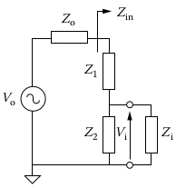

# Solutions to Problem Set Questions

## Question 1

**(i)** The SCP1000 barometric pressure sensor is the sensor being considered to interface through SPI communication protocol. The SPI interface is a full duplex 4-wire serial interface where the connection between the sensor the microcontroller (ESP8266 device) is done using the MOSI (Master Out Slave In), MISO (Master In Slave Out), SCLK (Serial Clock) and CS (Chip Select) I/O lines. The SCP1000 is configured to SPI slave mode.

The SPI communication frame contains two or three 8-bit words; the first word defines the register address (6-bits wide) followed by the bit to indicate the type of access (Read = 0 or Write = 1 ) and one zero-bit (LSB position). Lastly the third word is the data being read or written.

The MSB of the words are sent first where bits from the MOSI line are sampled in on the rising edge of the SCLK clock signal and bits to MISO line are latched out on the falling edge of SCLK.

The CS line stays low during the entire frame access process. If CS line changes to high, access is terminated.
The CS has to be pulled up after each communication frame.
The below C-routine indicates how the ESP8266-device will interface with the SCP1000 sensor.

```C
#define REVID_REG_ADDR 0x00
#define DATAWR_REG_ADDR 0x01
#define TEMPOUT_REG_ADDR 0x21

void write_data(uint8_t register_address, uint8_t data ){
    spi_master_transmit(register_address, 1, data);
}

void read_8bit_data(uint8_t register_address, uint8_t data){
    spi_master_read(register_address, 0, uint8_t data);
}

void read_16bit_data(uint8_t register_address, uint16_t data){
    spi_master_read(register_address, 0, data);
}

void app_main(void){
    uint8_t write_data = 0x55;
    uint8_t read8_data;
    uint16_t read16_data;
    init_esp_spi_protocol();
    write_data(DATA_WR_REG_ADDR, write_data);
    // Read from 8-bit data register 
    read_8bit_data(REVID_REG_ADDR, read8_data);
    // Read from 16-bit data register 
    read_8bit_data(TEMPOUT_REG_ADDR, read8_data);
}
```

**(i)** The Dallas 1-Wire Sensor is connected to one pin of the ESP8266 device. The transaction sequence for accessing the sensor is as follows:

1. Initialization

1. ROM command (followed by any required data exchange)

1. DS19B20 Function Command (followed by any required data exchange)

This wire sensor writes and reads data via a 64-bit lasered ROM code.
The below C-routine indicates how the ESP device interfaces with this sensor

```C
// ROM Command Set 
#define CMD_SEARCH_ROM 0xf0
#define CMD_READ_ROM 0x33
#define CMD_MATCH_ROM 0x55
#define CMD_SKIP_ROM 0xcc
#define CMD_ALARM_SEARCH 0xec
// Function Command Set
#define FUNC_CONVERT_T 0x44
#define FUNC_READ_SCRATCHPAD 0xbe
#define FUNC_WRITE_SCRATCHPAD 0x4e
#define FUNC_COPY_SCRATCHPAD 0x48
#define FUNC_RECALL_CONFIG 0xb8

void dallas_temp_init(void){
    esp_gpio_init();
    send_init_pulse();
}

void master_send_command(uint8_t cmd);
void master_send_function(uint8_t cmd);

void app_main(void){
    uint16_t data;
    dallas_temp_init(NULL);
    master_send_command(CMD_READ_ROM);
    master_send_function(FUNC_CONVERT);
    master_read_data(data);
}
```

## Question 2

### Case Study A : Leak Detection

- Computing Speed: Small
- I/O Transfer Rates: Signal Processing
- Memory Size: Distributed (accounts for logs)
- Units Sold: Small
- Development Cost: Small
- Lifetime: Small
- Environment: Signal Processing
- Cost Sensitivity: Small
- Other Constraints: Small
- Safety: Distributed
- Maintenance: Distributed
- Digital Content: Small
- Certification Authorities: Small
- Repair Time Goal: Mission Critical
- Initial Cycle Time: Small
- Product Variants: Small
- Engineering Allocation Method: Distributed
- Other Possible examples in this category: Water Pump control system

### Case Study B : Driver Assistance

- Computing Speed: Signal Processing
- I/O Transfer Rates: Mission Critical
- Memory Size: Signal Processing
- Units Sold: Signal Processing
- Development Cost: Mission Critical
- Lifetime: Signal Processing
- Environment: Mission Critical, Distributed
- Cost Sensitivity: Signal Processing
- Other Constraints: Signal Processing
- Safety: Mission Critical
- Maintenance: Mission Critical, Distributed
- Digital Content : Signal Processing
- Certification Authorities: Distributed, Small
- Repair Time Goal: Signal Processing
- Initial Cycle Time: Mission Critical
- Product Variants: Signal Processing
- Engineering Allocation Method: Mission Critical
- Other Possible examples in this category: Object Detection/Tracking

### Case Study C : Conveyor System

- Computing Speed: Distributed
- I/O Transfer Rates: Mission Critical
- Memory Size: Distributed
- Units Sold: Distributed
- Development Cost: Mission Critical
- Lifetime: Distributed
- Environment: Small
- Cost Sensitivity: Signal Processing
- Other Constraints: Signal Processing
- Safety: Distributed
- Maintenance: Distributed, Mission Critical
- Digital Content: Distributed
- Certification Authorities: Distributed/Signal Processing
- Repair Time Goal: Distributed
- Initial Cycle Time: Small
- Product Variants: Distributed
- Engineering Allocation Method: Mission Critical/ Distributed
- Other Possible examples in this category: Distributed

## Question 3

### a) A pointer to a pointer to an integer

```C
#include <stdio.h>

void main()
{
    int num = 10;
    int *p_;
    int **p; // Answer
    p_ = &num; // pointer p is pointing to the address of num
    p = &p_ // pointer pp uis a double pointer pointing to the address of pointer p
}
```

### b) An array of ten pointers to integers

```C
#include <stdio.h>

void main()
{
    int *p[10];
}
```

### c) A pointer to an array of ten integers

```C
#include <stdio.h>

void main()
{
    int (*p)[10];
}
```

### d) A pointer to a function that takes an integer as an argument and returns an integer

```C
#include <stdio.h>

int func(int param){
    int data = param + 1;
    return data;
}

void main()
{
    int (*p)(int n) = &func;
}
```

### e) An array of ten pointers to functions that take an integer argument and return an integer

```C
#include <stdio.h>

int func1(int n);
int func2(int n);
int func3(int n);
int func4(int n);
int func5(int n);
int func6(int n);
int func7(int n);
int func8(int n);
int func9(int n);
int func10(int n);

void main()
{
    int (*p[10])(int n);
    
    p[0] = func1;
    p[1] = func2;
}
```

## Question 4

The effective number of bits can be calculated using the equation:

$$ ENOB = \frac{SINAD - 1.76}{6.02} $$

Where:

- SINAD: (Signal, noise and distortion) is a power ratio indicating the quality of the signal in dB

- the 6.02 term converts decibels to bits

- the 1.76 term comes from quantization error in an ideal ADC

### Attenuators



The attenuation is given as:

$$ \frac{V_i}{V_o} \approx \frac{Z_2}{Z_1 + Z_2} $$

The impedances of $Z_1$ and $Z_2$ will influence the effective number of bits using the equation:

$$ dB_v = 20log_{10} \frac{V_{out}}{V_{in}} (dB) $$

This computed decibel value is used in the $ENOB$ equation to compute the effective number of bits.

### Amplifiers

The Gain of the amplifier is given as:

$$ A_v = \frac{V_{out}}{V_{in}} $$

The Gain of the amplifier given in decibels is given as:

$$ a_v = 20log(A_v) $$

The computed decibel value os used in the $ENOB$ equation to compute the effective number of bits.

### Analog Multiplexer Settling Time

The output voltage of a multiplexer can be given as:

$$ V_L(t) = V_o (1-e^{\frac{-t}{\tau}}) $$

Where:

$$ \tau = \frac{(R_o + R_{ON})R_L}{R_L + (R_o + R_{ON})}$$

The output voltage of the multiplexer given in decibels is given as:

### Anti-aliasing analog low pass filter roll-off

### Sample and hold -sampling time

## Question 5

### **Part a**

An embedded system is a system that has a computer processor or microcontroller embedded in it, which allows it to perform specific tasks. In this case, the embedded system is using a 12-bit ADC (Analog-to-Digital Converter) to sample the fluid flow through an oil pipe. The ADC converts the analog signal from the transducer and analog circuit into a digital signal that can be processed and stored by the embedded system.

The fluid flow through the oil pipe can vary from -20 to +20 L/min, and the transducer and analog circuit maps this range in a linear fashion to the 0 to +5V range of the ADC. This means that a fluid flow of -20 L/min will be mapped to 0V, and a fluid flow of +20 L/min will be mapped to +5V.

The ADC uses straight binary, so a voltage of 0V will be converted to a digital output of 0, and a voltage of +5V will be converted to the largest digital output that the 12-bit ADC is capable of producing.

Since the ADC uses fixed point representation to store the digital output, the resolution of the measurement will be limited by the number of bits used in the representation. In this case, since the ADC is 12-bit, the resolution of the measurement will be limited to

$$ \frac{1}{2^{12}} = \frac{1}{4096} $$

of the full scale range, or (0.0012 L/min {AI answer})

$$\frac{1}{4096} \times 20 = 0.0049 L/min$$

This means that the smallest change in fluid flow that can be detected by the system will be 0.0049 L/min (0.0012 L/min).

#### **Part a (i)**

If the fluid flow through the oil pipe is -10 L/min, the transducer and analog circuit will map this to a voltage to:

$$ \frac{-10 L/min}{20 L/min} \times 5V = -2.5V $$

Since the ADC uses straight binary, this voltage will be converted to a digital output of:

$$ \frac{-0.25V}{5V} \times 2^{12} = -204.8  $$

Since the ADC uses fixed point representation, the digital output will be stored as a 12-bit binary number with a format of

```text
[sign bit][integer part: 8-bits][fractional part: 3-bits]
```

gives a value of

```text
                                    1110 0110 0110 (1111 1111 0001 - AI answer)
```

This value is negative because the fluid flow is negative, and the magnitude of the value represents the magnitude of the fluid flow.

### **Part a (ii)**

Since the ADC is a 12-bit ADC, the resolution of the measurement will be limited to 1/4096 of the full scale range, or 0.0049 L/min (0.0012 L/min - AI answer). This means that the smallest change in fluid flow that can be detected by the system will be 0.0049 L/min (0.0012 L/min - AI answer). To store the oil flow data using fixed-point representation where 8-bits are used for the integer part and , we would need to use a signed 12-bit fixed-point number system with a resolution of 0.0049 L/min (0.0012 L/min - AI answer). This would allow us to accurately represent and store the oil flow data with the necessary level of precision.

### **Part b**

To store the readings from a measurement system with a range of 0 to 19.9 cm and a resolution of 0.1 cm in the smallest number of bytes, we would use a 16-bit fixed-point number system with 8 bits reserved for the fractional part. This representation scheme would allow us to store the readings from the measurement system with a resolution of 0.1 cm, and it would require the smallest number of bytes to store the readings.

To illustrate, let's consider the readings 4.1 cm and 19.7 cm. To represent these readings using a 16-bit fixed-point number system with 8 bits reserved for the fractional part, we would first need to determine the binary representation of the integer part of each number. For the reading 4.1 cm, the integer part is 4, which we can represent using binary as 0000 0100. For the reading 19.7 cm, the integer part is 19, which we can represent using binary as 0001 0011.

Next, we need to determine the binary representation of the fractional part of each number. For the reading 4.1 cm, the fractional part is 0.1, which we can represent using binary as 0001 1001 after multiplying by 2^8 and converting to binary. For the reading 19.7 cm, the fractional part is 0.7, which we can represent using binary as 0110 1110 after multiplying by 2^8 and converting to binary.

Finally, we need to combine the binary representations of the integer and fractional parts to get the fixed-point representation of each number. To do this, we simply concatenate the two binary numbers, which gives us 0000 0100 0001 1001 for the reading 4.1 cm and 0001 0011 0110 1110 for the reading 19.7 cm. This is the fixed-point representation of the readings using a 16-bit fixed-point number system with 8 bits reserved for the fractional part. This representation scheme would require 2 bytes to store each reading, making it the smallest number of bytes required to store the readings.

### Part C

The system uses an 8-bit DAC to convert digital values to analog values. The serial port receives 8-bit data values in 11-bit packets, with a start bit, 8 data bits, a parity bit, and a stop bit. The DAC receives a new 8-bit value for every 11-bit packet received over the serial port.

The serial port has a baud rate of 10000 bits/sec, which means it can transfer 10000 bits per second. Since the serial port receives 11-bit packets, it can receive up to 909 packets per second. The DAC, which has an 8-bit resolution, can output up to 909 different analog values per second.

It's important to note that the parity bit is used for error detection. It's a redundant bit that is added to the data to ensure that the data can be accurately transmitted over the serial port. The parity bit is calculated based on the other bits in the packet, and it allows the receiver to verify that the data was received correctly.

### Part C (i)

Based on the information you provided, the serial port receives 11-bit packets at a rate of 10000 bits/sec. Since each packet consists of a start bit, 8 data bits, a parity bit, and a stop bit, this means that the serial port can receive 8 bits of data per packet. At a rate of 10000 bits/sec, the serial port can receive 8 bits of data per packet, so it can receive up to 8 * 909 = 7272 data bytes per second.

### Part C (ii)

Based on the information you provided, the DAC receives 8-bit values for every 11-bit packet received over the serial port. The serial port has a baud rate of 10000 bits/sec, so it can receive up to 909 packets per second. Since the DAC receives a new 8-bit value for every packet, this means that it can output up to 909 different analog values per second. In terms of frequency, this means that the DAC can output up to 909 Hz.

### Part C (iii)

The maximal frequency that the DAC can reliably generate depends on several factors, such as the accuracy and stability of the clock signal that is used to control the DAC, as well as the DAC's own internal characteristics. In general, a DAC will have a maximum output frequency that is determined by its internal architecture and design.

Additionally, the maximal frequency that the DAC can reliably generate will also depend on the quality of the digital data that is being converted to analog values. If the digital data contains errors or is not updated frequently enough, the DAC's output may become distorted or inaccurate.

To determine the maximal frequency that the DAC can reliably generate, it would be necessary to consult the DAC's specifications or datasheet, and to evaluate the quality of the digital data being provided to the DAC. Without more information, it is not possible to provide a precise answer.
